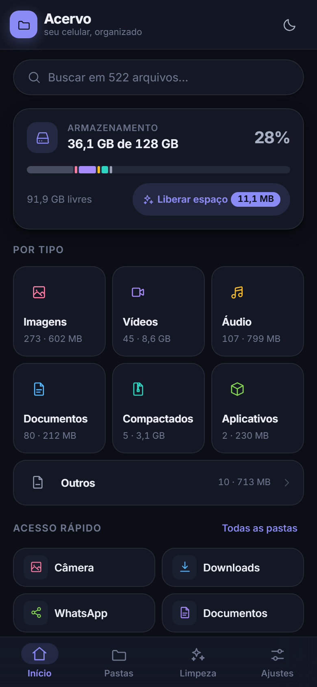
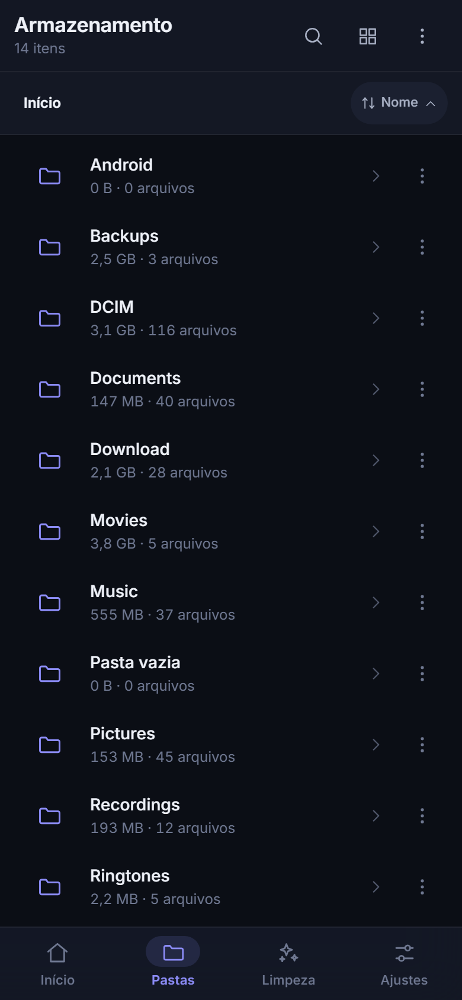
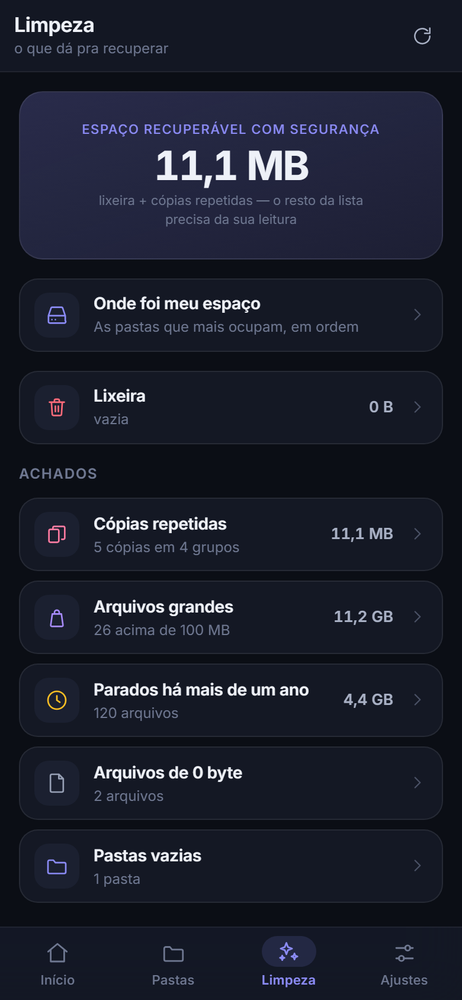
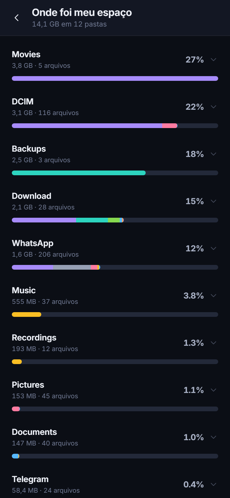
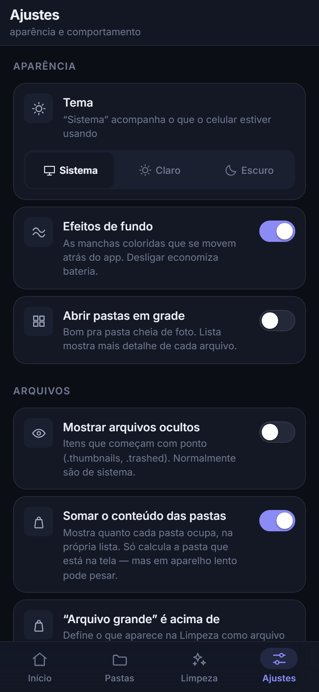

# Acervo

Organizador de arquivos e pastas do celular. Uso pessoal — sem conta, sem nuvem,
sem mandar nada pra lugar nenhum.

Roda **no navegador do PC** (com uma memória de celular simulada, pra você ver e
testar tudo agora) e **no celular como aplicativo Android** (aí sim mexendo nos
arquivos de verdade). É o mesmo código nos dois casos.

**O APK existe e foi testado num Android de verdade** — ver "Instalar no celular".

<p align="center">
  
  
  
  
</p>

> A terceira tela é a que resume o app. Ela separa **11,1 MB "recuperáveis com
> segurança"** (lixeira e cópias repetidas) dos **11,2 GB** em arquivos grandes e
> dos 4,4 GB parados há mais de um ano — que aparecem na lista, mas com o aviso
> de que *"o resto da lista precisa da sua leitura"*. Nenhum limpador de celular
> faz essa distinção, e é ela que separa liberar espaço de perder coisa.

---

## Ver funcionando agora, no PC

```bash
npm install
npm run dev
```

Abre `http://localhost:5173/`.

O app aparece dentro de uma moldura de celular centralizada — porque é um app de
celular, e mostrá-lo esticado em 1920px mentiria sobre como ele fica na mão.

**No PC ele usa dados de demonstração:** uma árvore Android completa (DCIM, Download,
WhatsApp, Documents, Music…) com ~520 arquivos, gerada por semente fixa. Renomear,
mover, excluir e criar pasta funcionam de verdade e ficam gravados — recarregar a
página mantém o que você fez. *Nenhum arquivo do seu computador é lido ou alterado.*
Pra voltar tudo ao início: **Ajustes → Restaurar a demonstração**.

Pra gerar a versão de produção:

```bash
npm run build     # sai em dist/
npm run preview
```

O `dist/index.html` abre direto no navegador, sem servidor (o app usa rotas com `#`).

> As capturas deste README foram feitas **desse jeito**: `npm run build`, servir a
> pasta `dist/`, fotografar em 390×844. São o app rodando, não montagem — os 522
> arquivos e os 36,1 GB que aparecem nelas vêm da mesma semente fixa que você vai
> ver ao rodar aí.

---

## O que ele faz

| Tela | O que resolve |
|---|---|
| **Início** | Quanto do armazenamento está usado e **de quê** (barra segmentada por tipo), atalhos pras pastas de sempre, favoritos, visitadas há pouco |
| **Pastas** | Navegação com trilha, lista **ou** grade, ordenação sempre visível, **toque longo pra selecionar**, **puxar pra atualizar**, o **tamanho de cada pasta na própria linha**, criar pasta, mostrar ocultos |
| **Por tipo** | Todas as imagens (ou vídeos, áudios, documentos…) do aparelho inteiro, num lugar só — com a pasta de origem em cada linha e **recortes por tamanho e período** |
| **Busca** | Por nome, no armazenamento todo ou dentro de uma pasta. Ignora acento: "relatorio" acha "Relatório" |
| **Limpeza** | Cópias repetidas, arquivos grandes, parados há mais de um ano, de 0 byte, pastas vazias |
| **Onde foi meu espaço** | As pastas de primeiro nível em ordem de tamanho, cada barra dividida por tipo de arquivo — a resposta pra "por que meu celular está cheio" |
| **Lixeira** | Tudo que você exclui passa por aqui antes de sumir. Cada item mostra de onde veio e volta pra lá |
| **Ajustes** | Tema (sistema/claro/escuro), efeitos de fundo, visão padrão, arquivos ocultos, somar pastas, limite de "arquivo grande", **notificações** |

**Tocar num arquivo abre a coisa**, quando o app sabe abrir: um `.zip` mostra o
conteúdo, um `.txt` mostra o texto. O que ele não sabe abrir cai na ficha de
detalhes — que é a resposta honesta pra "e agora?".

**Ações em qualquer arquivo ou pasta:** abrir, ler, detalhes, ir pra pasta de
origem, favoritar, renomear, mover, copiar, compartilhar, excluir — mais
**transformar em outro formato**, **deixar mais leve** e **proteger com senha**.

**Com vários selecionados:** mover, copiar, excluir, **renomear em lote** (com
prévia antes de tocar em arquivo nenhum), **compactar em .zip** e **gerar PDF**.

### Transformar em outro formato

Toque em **Transformar em…** e o app mostra só os destinos que ele realmente
entrega neste aparelho — cada um com o preço declarado na etiqueta.

| De | Vira |
|---|---|
| Foto (`.jpg`, `.png`, `.webp`, `.heic`…) | **JPG · PNG · WebP · PDF** |
| Texto (`.txt`, `.md`, `.log`, `.csv`, `.json`, `.xml`…) | **PDF** |
| Planilha `.csv` | **JSON** (a 1ª linha vira os nomes dos campos) |
| `.json` | **CSV** que abre no Excel, e **texto organizado** |
| `.md` / `.html` | **Texto puro**, sem as marcações |
| Qualquer arquivo | **ZIP** |

O original **nunca é apagado**: o resultado sai ao lado, com nome novo.

> **O CSV brasileiro usa ponto e vírgula.** O Excel em português exporta com `;`,
> e um leitor que só entende vírgula devolve uma coluna gigante em vez de erro —
> ninguém percebe até ser tarde. O app fareja o separador contando ocorrências
> *fora das aspas*, e grava CSV com `;` e BOM, que é o que o Excel abre em colunas
> sem pedir assistente de importação.

### Deixar mais leve

"Comprimir sem danificar" quer dizer duas coisas diferentes, e o app não finge
que é uma só:

- **Foto** → reencodada com menos dados, em três níveis de qualidade. Os pixels
  mudam, o olho não percebe, o arquivo costuma cair pra um terço.
- **Qualquer outro** → guardado num `.zip`. Volta **byte por byte igual**.

A tela mostra a balança **antes → depois com o número real** (a imagem é
reencodada de verdade na memória a cada ajuste, não estimada) mais a prévia do
resultado. **E quando não vale a pena, ela diz** — um JPEG já comprimido pode
sair maior do que era.

### Proteger com senha

**AES-GCM de 256 bits**, com a chave derivada da senha por PBKDF2-SHA256 em
210 mil rodadas. Quem faz a conta é o `crypto.subtle` do próprio sistema — o
trabalho aqui foi usar direito, não reinventar.

- O arquivo vira um `.acv` ao lado do original. **O nome do arquivo vai dentro,
  criptografado** — quem olha a pasta não descobre que ali estava `exame.pdf`.
- **GCM autentica:** um byte trocado faz a abertura *falhar*, em vez de devolver
  um documento silenciosamente alterado.
- Tocar no `.acv` pede a senha e devolve o conteúdo com o nome original.

> **Se você esquecer a senha, o arquivo se perde.** Não existe recuperação — é
> isso que significa estar criptografado, e a tela avisa antes, em letras
> grandes. Por isso a senha é pedida duas vezes e a força é medida na hora.

### Compactar e abrir `.zip`

| | O que faz |
|---|---|
| **Compactar em .zip** | Junta os arquivos selecionados num `.zip` de verdade, comprimido. Sai ao lado dos originais, sem sobrescrever nada |
| **Abrir um .zip** | Toque num `.zip` e veja o que tem dentro — nomes, tamanhos, quanto encolheu — antes de decidir extrair. Extrai numa subpasta com o nome do arquivo |
| **Gerar PDF** | De **imagens**: uma página por foto, folha A4 em pé ou deitada conforme a imagem. De **texto**: paginado em Courier |

**Limites, e o motivo:** 150 MB e 2.000 arquivos por `.zip`; 200 páginas por PDF;
150 MB por arquivo protegido. Tudo acontece na memória do aparelho — passar disso
trava o app em vez de entregar, então ele avisa antes em vez de tentar.

**O que ele NÃO faz, e por quê:**

- **`.rar` e `.7z`** — formatos fechados. Não existe descompressor pequeno o
  bastante pra caber aqui, e prometer que abre pra depois falhar é pior do que
  não oferecer. Só `.zip`.
- **PDF → imagem ou texto** — exigiria um interpretador de PDF inteiro. *Ler* PDF
  é uma ordem de grandeza mais difícil que escrever um.
- **Vídeo e áudio entre formatos** — o navegador decodifica, mas não codifica
  vídeo de forma utilizável. Isso é trabalho de ffmpeg, não de um app de arquivos.
- **`.docx`/`.xlsx`/`.pptx` → PDF** — converter esses exige renderizar o formato
  inteiro (layout, fontes, tabelas): é um editor de texto, não uma função. Pra
  eles, o caminho é "Compartilhar" e deixar o app que entende do formato converter.

### Voltar, e as notificações

**Voltar tem uma regra só**, valendo pro botão físico do Android, pro Esc do
teclado e pro **gesto de deslizar da borda esquerda**:

```text
1. tem folha/diálogo aberto?          → fecha ele
2. está dentro de uma subpasta?       → sobe UM nível
3. está numa tela que não é o início? → volta pro início
4. está no início?                    → toque duas vezes pra sair
```

**As notificações vêm desligadas** e só avisam quando você *não* está olhando o
app — ao terminar um trabalho que passou de 3 segundos, e quando o armazenamento
está quase cheio (no máximo uma vez por dia). Ligar o interruptor pede a permissão
do sistema de verdade; se ela for negada, o interruptor volta pra desligado em vez
de dizer sim e não fazer nada.

### Duas regras que o app não quebra

1. **Nada é irreversível com um toque.** Excluir vai pra lixeira, com "Desfazer" no
   aviso. Mover e copiar também têm "Desfazer" — mover 40 fotos pra pasta errada é
   mais fácil de fazer sem querer do que apagar 40. Só a tela da Lixeira apaga de
   vez, e ela pergunta com o número na cara.
2. **A Limpeza não limpa sozinha.** Ela mostra o que achou e deixa VOCÊ marcar. As
   cópias repetidas já vêm pré-marcadas, mas sempre poupando a mais antiga (o
   original). E ela avisa: comparação é por nome + tamanho, **não** por conteúdo.

<p align="center">
  
</p>

---

## Instalar no celular

O APK assinado está pronto:

```text
Área de Trabalho \ Acervo - instalar no celular \ Acervo.apk      (3,5 MB)
```

Mande pro celular (cabo, Drive, Telegram — tanto faz) e toque nele. O Android
avisa que vem de "fonte desconhecida"; é esperado pra qualquer app fora da Play
Store. As instruções completas estão no `COMO INSTALAR.txt` da mesma pasta.

**Na primeira abertura o app mostra uma tela pedindo pra liberar o acesso.** Isso
não é defeito: desde o Android 11 nenhum app enxerga o armazenamento sem uma
autorização que só pode ser dada nas configurações do sistema — não existe nem a
janelinha de "permitir agora". O app leva você direto à tela certa e detecta
sozinho quando você volta.

Pra gerar de novo depois de mexer no código:

```bash
npm run android:release      # build + sync + APK assinado
# sai em android/app/build/outputs/apk/release/app-release.apk
```

Passo a passo e solução de problemas em [`docs/android.md`](docs/android.md).

---

## Como está construído

```text
src/
├── fs/            A CAMADA QUE IMPORTA — o contrato de sistema de arquivos
│   ├── types.js         o contrato (list, stat, rename, move, copy, remove, mkdir…)
│   ├── mockProvider.js  implementação de MENTIRA — a demonstração do PC
│   ├── deviceProvider.js implementação REAL — Capacitor, arquivos do Android
│   ├── index.js         escolhe qual dos dois usar (a ÚNICA linha que sabe da diferença)
│   ├── util.js          caminho, categoria, formatação, ordenação (puro, sem I/O)
│   ├── scan.js          varredura da árvore: categorias, busca, achados da limpeza
│   ├── trash.js         lixeira (funciona igual nos dois providers)
│   ├── zip.js           criar e extrair .zip — sem biblioteca
│   ├── pdf.js           escritor de PDF (imagens e texto) — sem biblioteca
│   ├── cripto.js        proteger com senha (AES-GCM + PBKDF2, via crypto.subtle)
│   ├── imagem.js        decodificar e reencodar imagem (a base de converter e aliviar)
│   ├── converter.js     catálogo de destinos + CSV/JSON/Markdown/HTML
│   ├── otimizar.js      "deixar mais leve": foto reencodada ou .zip sem perda
│   ├── notificar.js     notificação do sistema (Capacitor no celular, Notification no PC)
│   ├── permissao.js     a ponte com o plugin nativo de permissão de arquivos
│   └── mockData.js      a árvore Android simulada, com sujeira plantada de propósito
├── state/         contexto do app, preferências, hooks de leitura, gestos, voltar
├── components/    Icone, Fundo, BarraAbas, ui/ (Botao, Folha, Dialogo, Avisos…), arquivo/
├── screens/       Inicio, Navegador, Categoria, Busca, Limpeza, Espaco, Lixeira, Favoritos, Ajustes, Permissao
└── styles/        tokens.css (FONTE ÚNICA do visual) + global.css

android/          o projeto Android (Capacitor). Entra no repositório porque tem
                  código escrito à mão: AcessoArquivos.java (a permissão de
                  "todos os arquivos"), MainActivity.java, o manifesto, os ícones.
                  A chave de assinatura NÃO entra — ver docs/android.md.
```

**A ideia central:** nenhuma tela importa `mockProvider` nem `deviceProvider`. Todas
falam com o contrato de `fs/types.js`. Foi isso que permitiu construir e testar o app
inteiro no PC hoje e apontar pros arquivos reais do celular depois sem reescrever
uma linha de tela.

**Trocar a cara do app** é editar `src/styles/tokens.css` — cor, espaço, tipografia e
raio saem todos de lá. Nenhum componente escreve `#hex` na mão.

Mais em [`docs/decisoes.md`](docs/decisoes.md).

---

## Verificação

Cinco bancadas em `testes/` — uma de funções puras e quatro que rodam o app num
Chromium de verdade:

```bash
npm run testar           # as cinco, em sequência
npm run testar:unidade   # 68 testes das funções puras — milissegundos, sem browser
npm run testar:layout    # overflow em 10 tamanhos × 2 temas, telas E folhas abertas
npm run testar:funcoes   # 110 casos pela interface: renomear, mover, desfazer, zip, pdf, senha…
npm run testar:dedo      # alvos de toque e ordem de foco por teclado
npm run testar:formatos  # zip, pdf e imagem, com validação CRUZADA contra o Windows

# E a que vale mais: o app rodando DENTRO do Android
npm run aparelho:preparar   # popula o /sdcard do aparelho com arquivos de teste
npm run aparelho:testar     # 13 casos, cada um conferido pelo adb por fora do app
```

Só `testar:unidade` roda sozinha. As outras quatro precisam do `npm run dev` numa
outra janela (elas avisam se ele não estiver no ar).

Estado atual: **68/68 unidade · 110/110 funcionais · 36/36 formatos · 13/13 no
aparelho · 0 achados de layout · 0 alvos de toque fora do padrão · 0 erros de
console.**

**As bancadas medem as FOLHAS, não só as telas.** Uma bancada que só navega entre
rotas nunca vê o menu de arquivo, a folha de transformar nem a de senha — que são
justamente onde ficam os controles densos. No dia em que passaram a abrir as
folhas, o primeiro achado apareceu na hora: o "X" de fechar tinha 34×34, abaixo do
alvo de dedo, desde o primeiro dia.

E medem **celular deitado** (740×360, 915×412) e **280px** (Galaxy Fold fechado),
além do retrato. Deitado é o caso que quebra na prática e ninguém testa: a altura
despenca e o rodapé com os botões é o primeiro a sair da tela — por isso há uma
checagem específica de "o botão de confirmar está alcançável".

### A bancada de aparelho

É a que responde a pergunta que ficou aberta o projeto inteiro: *"isso funciona num
Android de verdade?"*. Ela dirige o app instalado num emulador Android 16 pelo
protocolo do DevTools e **confere cada resultado pelo `adb`, olhando o sistema de
arquivos por fora**. Se o app disser "criei o .zip" e o `ls` não achar, reprova.

O que ela provou: o app lista `/sdcard` com tamanho e data corretos; cria pasta,
renomeia e exclui **no disco de verdade**; o `.zip` que ele escreve é aberto pelo
`unzip` do próprio Android; o PDF sai com `%PDF-1.7`; e excluir move pra
`/sdcard/.Acervo/Lixeira` levando o conteúdo junto.

**A verificação que mais vale é a cruzada.** Testar o `.zip` contra o próprio
código só provaria que ele é consistente consigo mesmo — um zip escrito errado e
lido errado do mesmo jeito passaria redondo. Então:

- um `.zip` criado pelo app é aberto pelo **`Expand-Archive` do Windows**, e o
  conteúdo confere byte a byte, com acento no nome e tudo;
- um `.zip` criado pelo **PowerShell** é lido e extraído pelo app;
- um arquivo protegido pelo app é decifrado pelo **`node:crypto` clássico**
  (`pbkdf2Sync` + `createDecipheriv`), que é outra implementação — prova que o
  formato é AES-GCM padrão, e não um dialeto que só o Acervo lê;
- a imagem convertida é conferida pelos **bytes mágicos**: se diz WebP, começa com
  `RIFF....WEBP`. Isso importa porque o Chrome que **não** sabe escrever um
  formato devolve PNG *em silêncio*, com o nome errado — nenhum erro, nenhum
  aviso, e o problema só aparece meses depois.

> Os testes já pagaram por si várias vezes. Um deles achou que a busca nunca
> classificava um acerto como "exato" (comparava o nome **com** a extensão, então
> digitar "contrato" não subia `contrato.pdf` pro topo). Outro achou que um
> arquivo extraído de um `.zip` não abria no leitor de texto — o mock guardava
> bytes e texto em lugares separados, coisa que no aparelho não acontece. E outro
> achou que o **gesto de voltar estava morto**: o efeito rodava uma vez com o
> elemento ainda inexistente e nunca mais rodava.
>
> E uma asserção precisou ser reescrita porque **não podia falhar**: ela comparava
> a mensagem de erro com um regex que casava com a própria frase de fallback.

---

Feito com Vite + React + Capacitor. Sem framework de UI, sem biblioteca de ícones,
sem biblioteca de zip, sem biblioteca de PDF — os 45 ícones são SVG desenhados no
próprio projeto, e o `.zip` e o PDF são escritos à mão. O que dava pra pedir ao
navegador (comprimir, decodificar imagem, **criptografar**) foi pedido a ele.

> **A criptografia é a exceção deliberada à regra de "escrever à mão".** Um
> formato de arquivo escrito errado não abre, e você descobre no primeiro teste.
> Um AES escrito à mão pode proteger, abrir de volta, parecer perfeito — e estar
> completamente quebrado. Erro em criptografia não aparece no comportamento;
> aparece anos depois, na mão de quem não devia ter acesso. Por isso `cripto.js`
> não implementa nada: ele **usa** o `crypto.subtle`, que é código nativo do
> sistema. O trabalho foi escolher direito (GCM e não CBC, IV por bloco, o nome do
> arquivo dentro do conteúdo cifrado) — não reinventar a conta.
